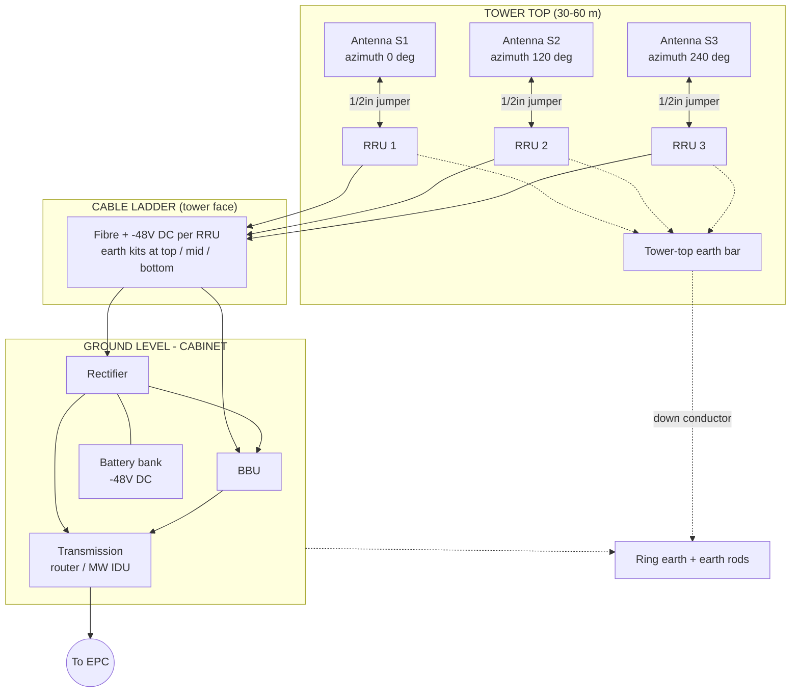
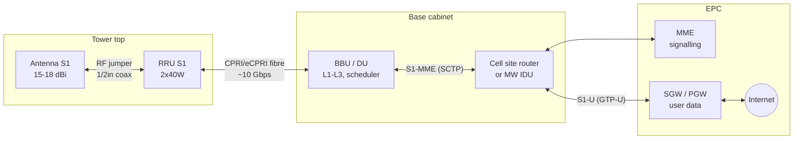
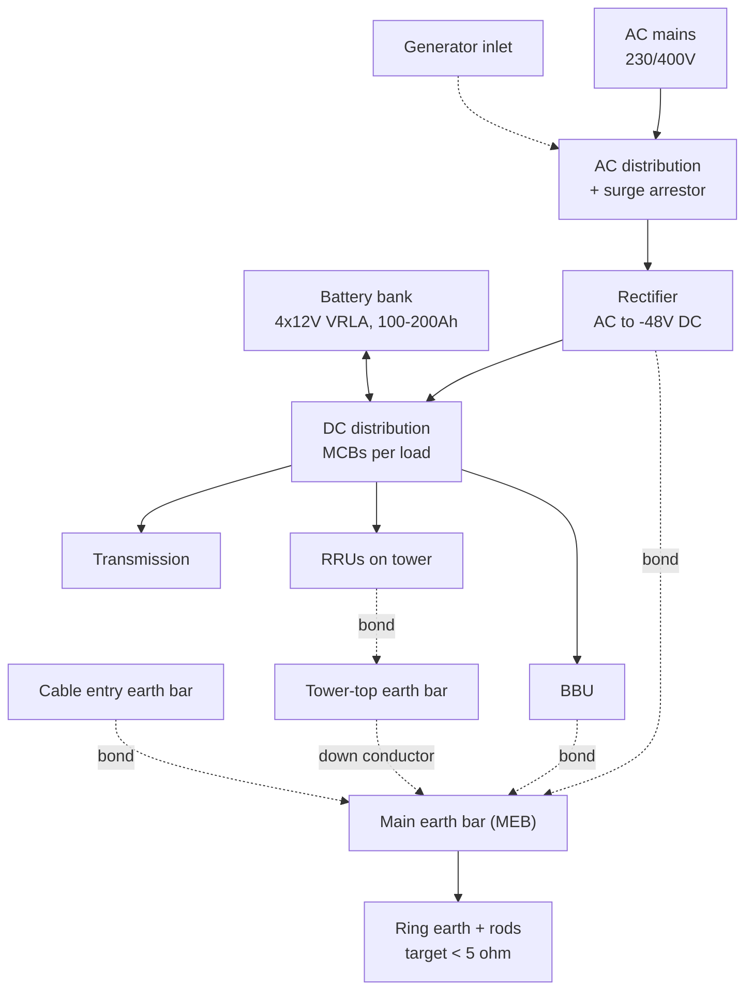
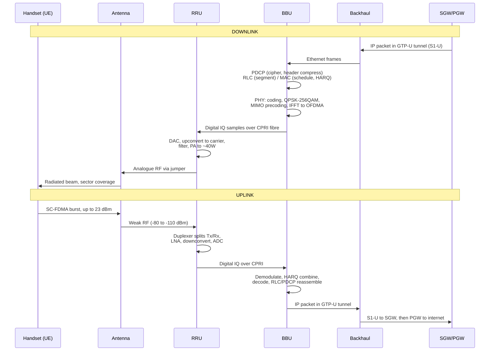

# LTE Macro Site — Week 1 Onboarding

*Part 1 of 2: sections 1–4. Faults, safety, glossary and the quiz come after your questions.*

---

## 1. Big picture

A handset is a radio with an IP stack bolted on. When you open a video, the phone transmits a small burst of RF to the nearest **cell site** — a tower carrying **antennas**. Behind each antenna sits an **RRU (Remote Radio Unit)** that converts RF into digital IQ samples and sends them down a fibre to the **BBU (Baseband Unit)** in a cabinet at the tower base. The BBU is the brain: it schedules who transmits when, decodes the bits, and terminates the radio protocol stack. Antennas + RRUs + BBU together are one logical node, the **eNodeB**. The BBU hands your IP packets to the **backhaul** (fibre or microwave), which carries them over the **S1 interface** to the **EPC (Evolved Packet Core)** — **MME** for signalling, **SGW/PGW** for user data — and out to the internet. The return path is the same in reverse. Everything on site exists to serve that chain, or to keep it powered and grounded.

---

## 2. Site walkthrough (top-down)

You've parked, signed the site log, and you're looking up.

**At the top (30–60 m):**

- **Antennas** — flat white panels, typically 1.4–2.6 m tall, mounted on pipe mounts on a headframe. Count them: three groups at roughly 0°, 120°, 240° azimuth. That's three **sectors**.
- **RRUs** — grey finned boxes bolted to the mount right behind or below each antenna, one per sector (sometimes two: one per band). Fins because they're passively cooled.
- **Short jumper cables** between RRU and antenna — 1/2" coax, weatherproofed with self-amalgamating tape and rubber boots.
- **Tower-top earth bar** — every mount, RRU body and jumper shield bonds to it.

**Down the tower face:**

- A **cable ladder** carrying fibre and **DC power** to each RRU, cable-tied every ~1 m, with a drip loop before entry.
- **Coaxial earth kits** on the jumpers/feeders at top, mid-point and bottom.
- **Obstruction lights** and, on many sites, a **microwave dish** for backhaul.

**At the base:**

- **Cabinet or shelter** containing the **BBU**, **rectifier/power system**, **battery bank**, **DC distribution breakers**, and the **transmission equipment** (a router or microwave IDU).
- **Fibre and power entry ports**, with a **cable entry earth bar** immediately inside.
- **Ring earth** — a buried copper conductor circling tower and cabinet, tied to earth rods.
- **AC supply** — mains meter, AC distribution box, and often a **generator/DG inlet socket**.

**Diagram 1 — Physical site layout.** Notice three things: (a) only *two* thin cables run up the tower per RRU — fibre and DC — not fat RF feeders; (b) the RF path is deliberately short (a 1 m jumper, not a 50 m run); (c) everything metallic funnels to one earthing system, not several.

---

## 3. Component deep-dive

**Antenna** *(CommScope, Kathrein, Amphenol are names you'll hear)*

- **Purpose:** convert guided RF into a shaped beam over a sector, and vice versa.
- **In/Out:** RF from jumper; RF into free space. Plus an **AISG** control cable for remote tilt.
- **Typical:** 15–18 dBi gain; 65° horizontal beamwidth; mechanical tilt 0–10°, electrical tilt (RET) 0–10°; 2 or 4 ports per band; 4.3-10 or 7/16 DIN connectors.
- **Physically:** sealed fibreglass panel, no LEDs, no power. If it looks fine, it usually is — the faults hide in its connectors.

**RRU / RU (Remote Radio Unit)** *(Ericsson Radio 4xxx; Huawei RRU5502; Nokia AirScale RRH)*

- **Purpose:** the "translator at the border" — literally, it converts digital baseband IQ samples to analogue RF and amplifies them, and does the reverse on receive.
- **In:** CPRI/eCPRI over fibre + −48 V DC. **Out:** RF to antenna.
- **Typical:** 2×40 W or 4×40 W per unit; 40–60 W DC idle, 300–700 W under load.
- **Physically:** finned aluminium box, ~10–25 kg, LC/DLC fibre ports, DC connector, and **LEDs: RUN (slow green blink = healthy), ALM (red = alarm), ACT.** Reading those LEDs from the ground with binoculars saves a climb.

**Jumper / feeder cable**

- **Purpose:** carry RF the last metre.
- **Typical:** 1/2" jumper; 7/8" feeder on older RF-at-the-bottom sites. Loss ~4–6 dB/100 m at 1800 MHz — which is exactly why we don't use long runs any more.
- **Watch for:** water ingress, cracked weatherproofing, PIM from a loose or corroded connector.

**Fibre / CPRI link**

- **Purpose:** carry digitised radio samples between BBU and RRU. Think of it as a conveyor belt of raw IQ numbers, not IP packets — CPRI is a constant-bit-rate, latency-critical link.
- **Typical rates:** 2.4576 / 4.9152 / 9.8304 / 10.1376 Gbps. 5G moves to **eCPRI** over 10/25 GbE, which *is* packet-based — that's the CU/DU split you'll hear about.
- **Physically:** single-mode 9/125 µm, LC or DLC connectors, coloured SFP modules. **A fingerprint on a ferrule is a real outage cause** — always clean and cap.

**BBU / DU (Baseband Unit)** *(Ericsson Baseband 6630; Huawei BBU5900; Nokia AirScale System Module; ZTE B8200)*

- **Purpose:** L1–L3 processing, scheduling, cell management, S1 termination.
- **In:** CPRI from RRUs, backhaul Ethernet, −48 V DC. **Out:** the same, in reverse.
- **Physically:** 1–3 RU subrack with pluggable boards — a **main control board**, **baseband boards**, **fan module**, **power module**. Each board has RUN/ALM/ACT LEDs. The USB/serial **LMT port** on the front is where you plug in for local maintenance.

**Transmission / backhaul**

- **Purpose:** carry S1 traffic to the core.
- **Typical:** 1–10 Gbps fibre, or microwave at 100–500 Mbps. Look for a cell site router/switch and, if microwave, an **IDU** in the cabinet feeding an **ODU** on the dish.

**Power system**

- **Rectifier:** converts AC mains to **−48 V DC** (float ~54 V). Modular, hot-swappable, fans and LEDs on the front.
- **Batteries:** 4 × 12 V VRLA strings in series, 100–200 Ah, giving 2–8 h autonomy.
- **DC distribution:** MCBs per load — one per RRU, one for BBU, one for transmission. **Label discipline here is what makes fault isolation fast.**

**Diagram 2 — Logical block diagram.** Notice that the S1 interface *splits*: control plane to the MME, user plane to the SGW. A site can be "up" on S1-U and still refuse attaches if S1-MME is down. Also notice the eNodeB boundary — antenna, RRU and BBU are one node to the core.

**Diagram 3 — Power and grounding.** Notice the batteries sit *across* the DC bus, not in series with it — they float and take over instantly on mains failure. And notice earthing is a **star into one main earth bar**, never a chain between cabinets: two separate earths at different potentials is how you fry an SFP in a thunderstorm.

---

## 4. Signal flow

**Diagram 4 — Signal flow.** Notice where the boundary between *digital* and *analogue* sits: it's inside the RRU, not the BBU. Everything on the fibre is numbers; everything on the jumper is RF. That single fact tells you which faults show as **CPRI alarms** (fibre, SFP, BBU port) versus which show as **VSWR alarms** (jumper, connector, antenna).

**Why RRU at the top, BBU at the bottom** — the one exam question everyone gets asked:

- RF loss in coax is brutal (~5 dB per 100 m at 1800 MHz). Losing 5 dB is losing ~70% of your power *and* desensitising the receiver. Fibre loss is ~0.35 dB/km. So put the amplifier where the antenna is and send digits, not RF, down the tower.
- **Literal statement:** moving the power amplifier and LNA to the antenna eliminates feeder loss in both directions, improving downlink EIRP and uplink sensitivity, while CPRI over fibre carries the baseband with negligible loss.
- The BBU stays at the bottom because it needs mains power, active cooling, and hands on it for maintenance — nobody wants to climb 50 m to reseat a board.

**Voice:** on a modern LTE network, voice is **VoLTE** — just IP packets on a dedicated bearer (QCI 1) toward the IMS. The physical path across the site is identical to data; only the priority differs.

---

## Appendix — image-generation prompts

The diagrams above are code-rendered. If you want photoreal or illustrated visuals, paste these into any image-capable model:

1. **Site elevation:** *"Technical illustration, isometric view of a 45-metre LTE macro cell tower. Three sectors of white panel antennas at 0/120/240 degrees on a triangular headframe, grey finned RRU boxes mounted directly behind each antenna, thin fibre and DC cables running down a vertical cable ladder to a green outdoor equipment cabinet at the base. Buried copper ring earth shown as a dashed circle. Clean labelled callouts, engineering-drawing style, muted colours, white background."*
2. **RRU close-up:** *"Photorealistic close-up of a remote radio unit mounted on a galvanised pipe mount behind a panel antenna. Aluminium heat-sink fins, weatherproofed coax jumper with black rubber boot, two LC fibre connectors and a DC power connector on the underside, small green and red status LEDs. Overcast sky, shallow depth of field."*
3. **Cabinet interior:** *"Cutaway technical illustration of an outdoor telecom cabinet interior: BBU subrack with pluggable boards and status LEDs at top, modular rectifier shelf in the middle, DC distribution panel with labelled miniature circuit breakers, four 12V VRLA batteries at the bottom, copper earth bar on the side wall. Labelled, flat vector style."*
4. **Signal chain:** *"Horizontal infographic showing the transformation of a signal: IP packet → digital baseband IQ samples → fibre → analogue RF → radiated beam → handset. Each stage as a distinct icon with a short label, left-to-right flow, blue and orange palette, flat design."*

---

*Any questions before we go into faults and safety?*
